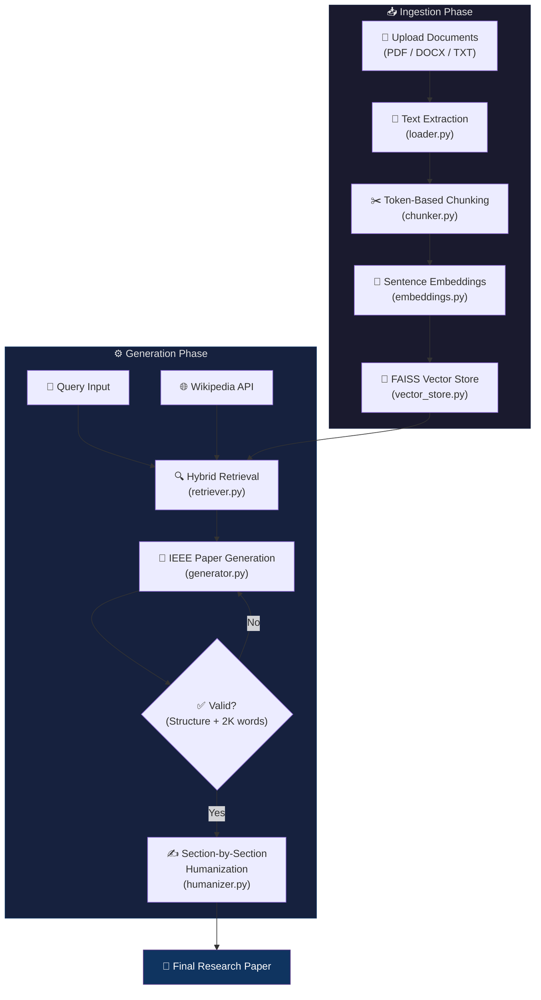

<div align="center">

# 📄 Humanized Research Paper Generator

### _Transform your documents into polished, IEEE-structured research papers that read like they were written by a human._

[](https://www.python.org/)
[](https://groq.com/)
[](https://github.com/facebookresearch/faiss)
[](https://gradio.app/)
[](LICENSE)

<br/>


<br/>

> **Upload PDFs, DOCX, or TXT files → Enter your topic → Get a complete, human-sounding IEEE research paper in minutes.**

</div>

---

## 🌟 Why This Project?

Most AI-generated academic papers suffer from two fatal flaws: **robotic prose** and **hallucinated citations**. This project solves both by combining a **Retrieval-Augmented Generation (RAG) pipeline** with a **multi-pass humanization engine** that rewrites each section with academic burstiness and natural phrasing — making the output virtually indistinguishable from human-written text.

<div align="center">

### ⚡ Key Highlights

</div>

| Feature | Description |
|:---|:---|
| 🔍 **Dual-Source Retrieval** | Combines your uploaded documents (via FAISS) with live Wikipedia context |
| 🧠 **LLaMA 3.3 70B via Groq** | Blazing-fast inference with one of the most capable open-source LLMs |
| ✍️ **Section-by-Section Humanization** | Each IEEE section gets a tailored rewrite prompt for natural academic prose |
| ✅ **Auto-Validation & Retry** | Validates IEEE structure + 2,000-word minimum; auto-retries up to 3 times |
| 📊 **Token Budget Management** | Precise token counting with `tiktoken` and hard budget enforcement |
| 🖥️ **Gradio Web Interface** | Clean two-panel UI — upload on the left, generated paper on the right |

---

## 🏗️ Architecture



---

## 📂 Project Structure

```
📦 Humanized-Research-Paper-Generator
├── 🚀 app.py              # Gradio web interface & event wiring
├── 🤖 agent.py             # Orchestrator — connects all pipeline stages
├── 📄 loader.py            # Text extraction (PDF, DOCX, TXT)
├── ✂️  chunker.py           # Token-aware text chunking with overlap
├── 🧬 embeddings.py        # SentenceTransformer embedding wrapper
├── 💾 vector_store.py      # FAISS index management & search
├── 🔍 retriever.py         # Hybrid retrieval (FAISS + Wikipedia)
├── 📝 generator.py         # IEEE paper generation with validation loop
├── ✍️  humanizer.py         # Multi-pass section-by-section humanization
├── 🔢 token_utils.py       # Centralized tiktoken counting & truncation
├── 📋 requirements.txt     # Python dependencies
├── 🔒 .env                 # API keys (not tracked by git)
└── 🚫 .gitignore           # Git ignore rules
```

---

## ⚙️ How It Works

### Phase 1: Document Ingestion

```
Documents (PDF/DOCX/TXT) → Text Extraction → Token-Based Chunking → Embeddings → FAISS Index
```

1. **`loader.py`** — Extracts raw text from uploaded files using `pypdf`, `python-docx`, or plain file reading.
2. **`chunker.py`** — Splits text into ~200-token chunks with 25-token overlap, breaking at natural boundaries (newlines, periods, spaces).
3. **`embeddings.py`** — Generates 384-dimensional embeddings using the `all-MiniLM-L6-v2` SentenceTransformer model.
4. **`vector_store.py`** — Stores embeddings in a FAISS `IndexFlatL2` index for fast similarity search.

### Phase 2: Paper Generation

```
Query → Hybrid Retrieval (FAISS + Wikipedia) → LLM Generation → IEEE Validation → Humanization
```

5. **`retriever.py`** — Retrieves context from two sources with token budget enforcement:
   - **FAISS** (60% budget): Semantic search over your uploaded documents
   - **Wikipedia** (40% budget): Live summary retrieval for broader context
6. **`generator.py`** — Sends context + query to **LLaMA 3.3 70B** via Groq API with:
   - Strict IEEE section requirements (Abstract → References)
   - 2,000-word minimum enforcement
   - Up to 3 automatic retries with multi-turn correction
   - Input token limit enforcement (fits within 32K model context)
7. **`humanizer.py`** — Rewrites the paper section-by-section:
   - Tailored instructions per section type (abstract, methodology, results, etc.)
   - Skips sections that shouldn't be altered (title, author, references)
   - Enforces token floors (40 tokens) and ceilings (1,200 tokens) per section
   - Produces high-burstiness prose with varied sentence lengths

---

## 🚀 Quick Start

### Prerequisites

- **Python 3.10+**
- **Groq API Key** — Get one free at [console.groq.com](https://console.groq.com)

### 1. Clone the Repository

```bash
git clone https://github.com/AndyTue/Humanized-Research-Paper-Generator.git
cd Humanized-Research-Paper-Generator
```

### 2. Create a Virtual Environment

```bash
python -m venv venv

# Windows
venv\Scripts\activate

# macOS / Linux
source venv/bin/activate
```

### 3. Install Dependencies

```bash
pip install -r requirements.txt
```

### 4. Configure Environment Variables

Create a `.env` file in the project root:

```env
GROQ_API_KEY=your_groq_api_key_here
```

### 5. Launch the Application

```bash
python app.py
```

The Gradio interface will open at `http://localhost:7860` 🎉

---

## 🖥️ Usage

<table>
<tr>
<td width="50%">

### Step 1 — Upload Documents
Upload one or more reference documents (PDF, DOCX, or TXT) and click **"Process Documents"**. The system will extract, chunk, embed, and index the text.

### Step 2 — Enter Your Topic
Type your research topic or query in the text field.

### Step 3 — Generate
Click **"Generate Research Paper"** and wait while the pipeline retrieves context, generates the IEEE draft, and humanizes the output.

</td>
<td width="50%">

### 📋 Output Format (IEEE)

```
# Title
# Author: Andres TurrIzA
# Abstract
# Index Terms
# 1. Introduction
# 2. Literature Review
# 3. Methodology
# 4. Results
# 5. Discussion
# 6. Conclusion
# Acknowledgment
# References
```

</td>
</tr>
</table>

---

## 🧠 Tech Stack

<div align="center">

| Layer | Technology | Purpose |
|:---:|:---|:---|
| 🖥️ | **Gradio** | Interactive web interface |
| 🤖 | **Groq + LLaMA 3.3 70B** | LLM inference (generation + humanization) |
| 🧬 | **SentenceTransformers** (`all-MiniLM-L6-v2`) | Document embedding |
| 💾 | **FAISS** (`IndexFlatL2`) | Vector similarity search |
| 🌐 | **Wikipedia API** | External knowledge retrieval |
| 🔢 | **tiktoken** (`cl100k_base`) | Precise token counting |
| 📄 | **pypdf / python-docx** | Document parsing |

</div>

---

## 🔧 Configuration & Tuning

The pipeline exposes several constants you can tune without modifying the core logic:

| File | Constant | Default | Description |
|:---|:---|:---:|:---|
| `chunker.py` | `CHUNK_SIZE_TOKENS` | `200` | Tokens per chunk |
| `chunker.py` | `CHUNK_OVERLAP_TOKENS` | `25` | Token overlap between chunks |
| `retriever.py` | `CONTEXT_TOKEN_BUDGET` | `23,500` | Total context budget |
| `retriever.py` | `FAISS_BUDGET_RATIO` | `0.6` | FAISS share of budget |
| `generator.py` | `MODEL_TOKEN_LIMIT` | `32,768` | Model context window |
| `generator.py` | `max_tokens` | `8,000` | Max generation tokens |
| `humanizer.py` | `MIN_SECTION_TOKENS` | `40` | Skip sections below this |
| `humanizer.py` | `MAX_SECTION_INPUT_TOKENS` | `1,200` | Truncate sections above this |

---

## 📖 Pipeline Deep Dive

<details>
<summary><b>🔍 Retrieval Strategy</b></summary>

The retriever uses a **dual-source** approach with hard token budgets:

- **FAISS (60%)** — Embeds the user query and runs L2 similarity search against the indexed document chunks. Returns the top-k most relevant chunks.
- **Wikipedia (40%)** — Searches for the best matching Wikipedia article and retrieves a summary. Handles disambiguation errors gracefully.

Both sources are truncated to their respective token budgets before being combined into the final context string.

</details>

<details>
<summary><b>✅ Auto-Validation Loop</b></summary>

After generation, the paper is validated against:
1. **Structural completeness** — All 8 IEEE sections must be present
2. **Minimum word count** — Paper must exceed 2,000 words

If validation fails, the generator uses **multi-turn correction**: it includes the previous draft as an assistant message and sends only a concise correction note, avoiding re-sending the full context and saving tokens.

</details>

<details>
<summary><b>✍️ Humanization Engine</b></summary>

The humanizer splits the paper into sections using markdown headers and applies **section-specific rewriting instructions**:

- **Abstract** → Natural phrasing, varied sentence length
- **Introduction** → Genuine curiosity, "We/Our" voice
- **Methodology** → Explains "why" not just "what", active voice
- **Results** → Precise reporting, contextualised findings
- **Discussion** → Hedging language, critical engagement
- **Conclusion** → Reflective tone, avoids cliché openers

Sections like **Title**, **Author**, **References**, and **Index Terms** are preserved verbatim.

</details>

---

## 🤝 Contributing

Contributions are welcome! Here's how to get started:

1. **Fork** the repository
2. **Create** a feature branch (`git checkout -b feature/amazing-feature`)
3. **Commit** your changes (`git commit -m 'Add amazing feature'`)
4. **Push** to the branch (`git push origin feature/amazing-feature`)
5. **Open** a Pull Request

---

## 📄 License

This project is licensed under the **MIT License** — see the [LICENSE](LICENSE) file for details.

---

<div align="center">

**Built with ❤️ by [Andres TurrIzA](https://github.com/AndyTue)**

_Powered by open-source AI — LLaMA 3.3, FAISS, SentenceTransformers, and Gradio_

<br/>

⭐ **Star this repo if you found it useful!** ⭐

</div>
